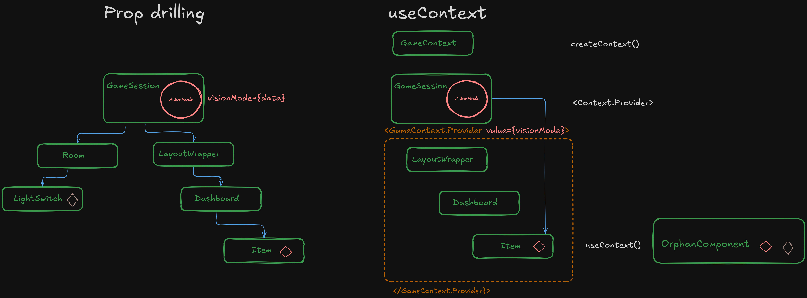

# React useContext Deep Dive

[](https://drive.google.com/file/d/1Xy-oK3R5tV64OPprB8PGCQXX-XA9E5ss/view?usp=drive_link)

## Overview

This project demonstrates the power of React's Context API through a practical example of a "Night Vision Goggles" application. You'll learn how to solve the prop drilling problem using `useContext` and understand when and how to use Context in your React applications.

## Visual Guide



## What You'll Learn

1. Understanding the prop drilling problem
2. Creating and using React Context
3. Implementing Context Providers
4. Consuming Context with `useContext`
5. Best practices for Context usage
6. Advanced concepts like default values and global context

## Project Structure

```bash
src/
├── components/
│   ├── GameSession.jsx    # Main component with Context Provider
│   ├── LayoutWrapper.jsx  # Intermediate component
│   ├── Dashboard.jsx      # Container component
│   └── Item.jsx           # Consumer component using Context
├── context/
│   └── GameContext.js     # Context definition
└── App.jsx                # Root component
```

## Key Concepts

### 1. Prop Drilling Problem

- Passing props through multiple intermediate components
- Code becomes less maintainable
- Components get cluttered with unused props

### 2. Context Solution

- Create a Context using `createContext()`
- Provide data using `<Context.Provider>`
- Consume data using `useContext()`

### 3. Implementation Steps

1. Create the Context
2. Set up the Provider
3. Clean up intermediate components
4. Consume the Context

## Getting Started

1. Clone this repository
2. Install dependencies:

   ```bash
   npm install
   ```

3. Start the development server:

   ```bash
   npm run dev
   ```

## Code Examples

### Creating Context

```javascript
// src/context/GameContext.js
import { createContext } from "react";

const GameContext = createContext({
  visionMode: "dark",
  toggleVision: () => {
    console.warn("Provider might be missing!");
  },
});

export default GameContext;
```

### Using Context Provider

```javascript
// In GameSession.jsx
<GameContext.Provider value={contextValue}>
  {/* Your components */}
</GameContext.Provider>
```

### Consuming Context

```javascript
// In Item.jsx
const { visionMode } = useContext(GameContext);
```

## Best Practices

1. Place Providers at the lowest common ancestor
2. Use default values for testing and safety
3. Split contexts for different concerns
4. Consider performance implications
5. Use the new `use` hook in React 19 for conditional context consumption

## Common Questions

1. **When to use Context vs. props?**

   - Use props for direct parent-child communication
   - Use Context when data needs to skip multiple levels

2. **Can I have multiple Contexts?**

   - Yes! Create separate contexts for different concerns

3. **What about performance?**
   - Context re-renders all consumers when value changes
   - Consider splitting contexts

## Additional Resources

- [React Context Documentation](https://react.dev/learn/passing-data-deeply-with-context)
- [React use Hook Documentation](https://react.dev/reference/react/use)
